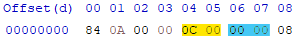

A tool to compile Source 2 assets manually.

## What's the use for this tool?
Many assets in Source 2 games still don't have a way to be compiled, or are tied to systems that are still work in progress which means that their compilers are just not shared to the public yet by Valve. 

As a good chunk of assets are text or KeyValues based, it's usually not too hard to read what they do, however they can't be modified easily as they are saved in a binary format. Some of the assets include: **Pulse Graphs**, **Response Rules** or **AnimGraphs in CS2** and more.

This tool is meant to allow editing of such assets, or creating new ones from scratch, with completely custom block layout and the data inside them. The outputted files will be in already compiled format (with **_c** extension) ready to be used by the game engine.

> [!NOTE]
> This tool is still in an early development state and will not support every asset, such as models for example. The tool has been tested on a tiny subset of assets that exists, and it might generate invalid files in some cases. If that happens you're welcome to open an issue. Depending on the popularity, this tool will be devloped further to introduce more features. You are also welcome to contribute yourself!

> [!WARNING]
> This tool is meant for somewhat experienced modders. Assets created in this way have no easy way to be validated by the game, because they were not compiled by using their official compiler, which could properly verify it. This means that due to any, even tiny mistakes the asset might not work or cause crashes with very little or no explaination from the game. You're on your own here!

### TODO
- [ ] Support more asset types / KV3 versions
- [ ] Allow binary data to be used as input
- [ ] vxml layout content compiler
- [ ] `--watch` parameter to recompile asset right after saving
- [ ] filelist input

## Usage
There are a few ways of using the asset builder. Files can either be created from scratch with a custom layout, or an existing asset can be edited by swapping out own provided block data.

## Creating Assets
First one is to use a JSON 'Schematic' file that defines the structure of the asset and the files that go with it. The second one is to use a preset or a structure based on an existing asset, and provide the inputs manually.
### JSON Schema usage
This is example of a JSON file usable with this tool. It defines the valid structure for a VPULSE asset.
You can find more examples in the `examples` directory.
```json
{
    "info": {
        "headerversion": 12,
        "version": 0
    },
    "blocks": [
        {
            "type": "kv3",
            "name": "RED2",
            "file": "eventhandler_redi.kv3"
        },
        {
            "type": "kv3",
            "name": "DATA",
            "file": "eventhandler.kv3"
        }
    ]
}
```
There's a few things going on here so let's explain:

The `info` block contains the information stored at the very beginning of the asset. They usually determine the asset type as read by the game. `headerversion` (Marked yellow) is a 2 byte integer starting at 5th byte from the start, `version` (Marked blue) is also a 2 byte integer starting at the 7th byte. Both these values, are little-endian.



The `blocks` section contains an array of blocks that are part of the asset. Every object contains the following parameters:

- `type` - type of data stored, supported values right now are: `kv3v4`, `kv3v3` or `kv3` (which will default to binary v4) and also just plain text: `text`
- `name` - name of the block (as can be seen in Source 2 Viewer). It must be a **4 letter ASCII string**.
- `file` - the source file to use for this block's data. File path is **relative** to the directory of the JSON file.

To use a schema file for compilation use the `-s` or `--schema` parameter with the relative path and file name to the schema file. Like with every method, specifying the output file with `-o` or `--output` is also required.

### Preset usage
It's also possible to use a ready to go preset for some asset types.
Currently supported (and tested) asset types include:

| Preset name | Asset type |
| ---- | ----------- |
| `vpulse` | Pulse Graph |
| `vrr` | Response Rules |
| `cs2vanmgrph` | CS2 AnimGraph |
| `smartptop` | Smart Prop |

To compile using a preset use the `-p` or `--preset` flag, with the preset name from the table. The parameter also requires a certain number of input files depending on the type, provied one after another with `-f` or `--files` parameters. As always it also requires the `-o` or `--output` parameter with the filename.

example:
`python assetbuilder.py -p vpulse -f pulsefile_redi.kv3 pulsefile.vpulse -o pulsefile.vpulse_c`

### Using a existing asset as a base
If there's no provided preset or you don't want to create a custom JSON file, instead of `-p/--preset` it's possible to use `-b/--base` argument and provide a compiled asset file, it will be used as a structure for the compiled asset. The usage is very similar as when using the presets (see above).
**NOTE** Only more basic assets will be supported, as only text and kv3 data is supported at this moment.

## Editing assets
More compilcated assets can be edited directly, by swapping out their 'blocks'. This might be useful for smaller changes, without having to recompile an asset if an ordinary recompilation of it is hard or impossible. To do so use the `-e` or `--edit` parameter, followed by an input file, and the blocks that you want swapped. Afterwards input the same order with the `-f` argument.

example: swapping out the `DATA` block of a vmdl asset:
`assetbuilder.py -e wraith.vmdl_c DATA -f wraith_data.kv3 -o wraith_new.vmdl_c`

## Installation
Requirements: Python (preferably >= 3.12.5) and pip.
It is a good idea to create a VENV, to isolate the dependencies, however it is not necessary. Read more here:
https://docs.python.org/3/tutorial/venv.html

Either in a virtual environment or in a global context run:
`pip install -r requirements.txt`. After it's done you should be good to go.

## Contributing
There are no hard set rules for contributing. Fixes or code improvements and refactorizations are very welcome. If you're planning on adding a new feature, it might be a good idea to discuss it first or to create a draft pull request **early** to get the idea across.
 I don't want you to waste your time working on a feature that might not be fitting for the vision of this software.

## Attributions
Creating this was made hugely possible thanks to people behind ValveResourceFormat/Source2Viewer, and their work on reverse engineering the asset format. Some data structures were directly used from their software's code **MIT License | Copyright (c) 2015 ValveResourceFormat Contributors**